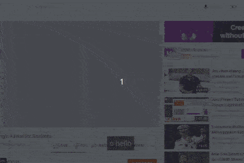

# gimana2

_gimana2_ is a Chrome extension that displays audio transcription of web content. Since not all Youtube videos offers captioning,_gimana2_ provides a way for people who prefers text to understand the content.

_Important notice: the app listens to sound directly from your computer's mic, so be sure to be someplace quiet for better results_

## Development

1. Clone this repo to your local computer,
2. Open `chrome://extensions/` on Chrome and enable developer mode (you need this to load extension from local folder),
3. Click "Load unpacked" and navigate to the directory where you cloned the project and select the project folder
4. The extension should appear on the top bar of your browser (if not, you can click the "puzzle" icon, then pin the extension).
